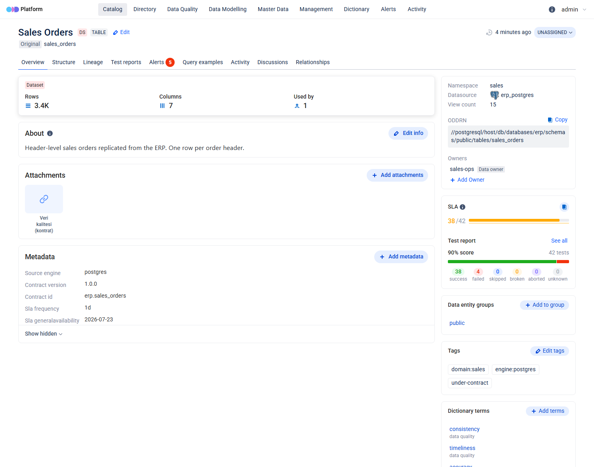
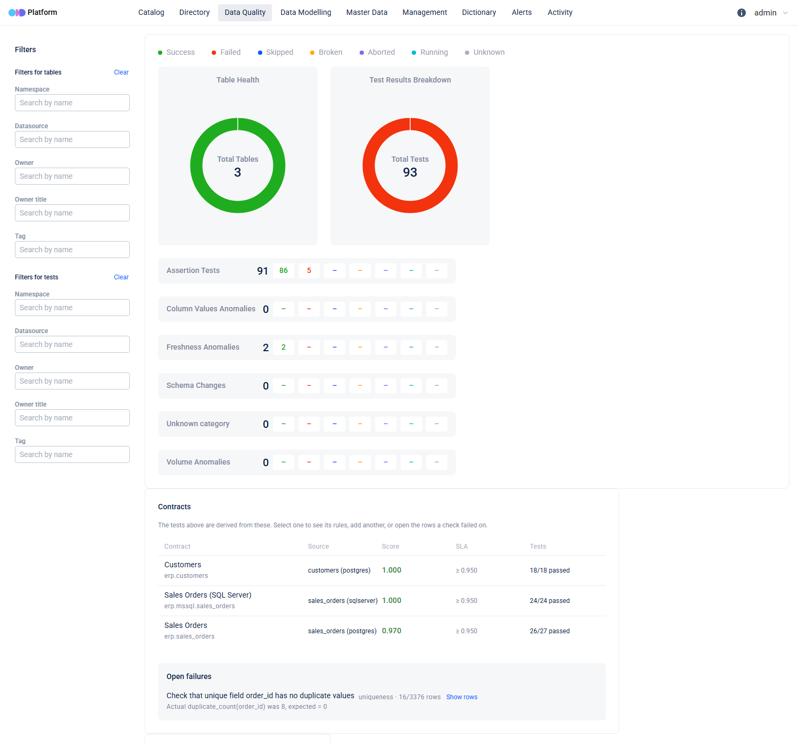
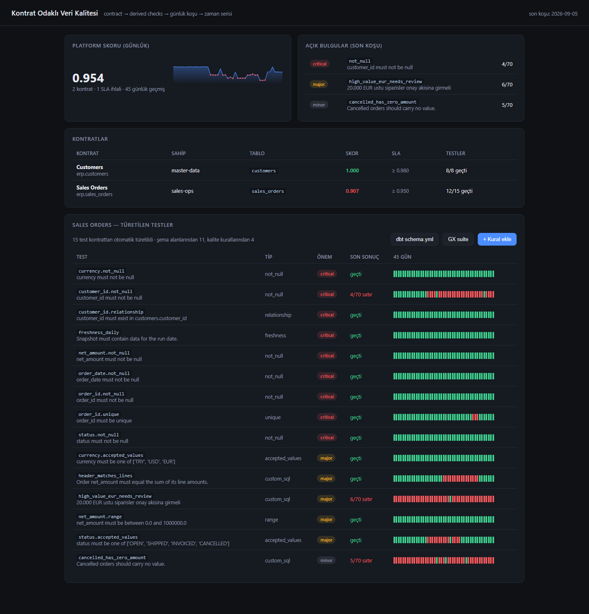
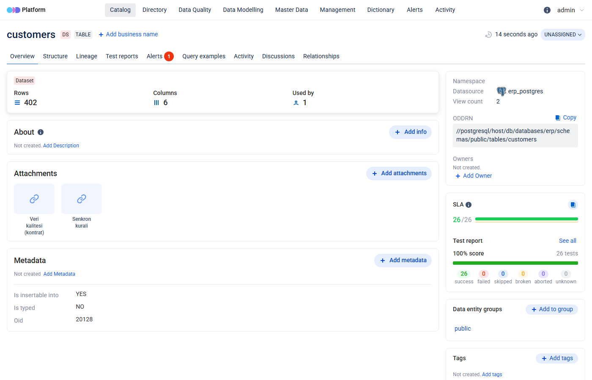
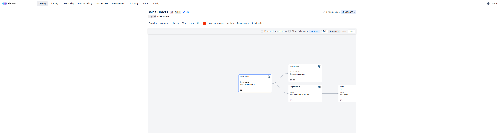

# lightweight-data-platform

Contract-driven data quality on top of **OpenDataDiscovery**. The catalog,
search, glossary, alerting and schema discovery are ODD's. The contracts, the
daily run, the score and the trend are here. Ten contracts, 228 checks a day,
45 days of history, PostgreSQL.

**New here?** [`docs/architecture.md`](docs/architecture.md) is how it works,
in diagrams. [`docs/tutorial.md`](docs/tutorial.md) is eight lessons that each
end in something you can see.

```
contract.yaml ──> derived checks ──> daily run (as-of date) ──> time series ──> score / SLA
                                            │
                                            └──> ODD Platform: catalog, tests,
                                                 run history, column stats,
                                                 ER relationships, alerts
```

## The position

Every line we write is a line the community does not maintain for us. So the
question this project keeps asking is not "what can we build" but **"what is
still missing after ODD and datacontract-cli have done their part"**.

### Adopt, do not build

| need | what covers it | why not us |
|---|---|---|
| catalog, search, glossary, ownership, RBAC | **ODD Platform** (Apache-2.0, active) | Postgres full-text, no Elasticsearch. Their last 25 commits are all search |
| schema discovery | **odd-collector** | 64 MB, one config file |
| column profiling | **odd-collector-profiler** | string lengths, means, inferred types |
| alert lifecycle | **ODD Platform** | opens on failure, closes itself on the next pass. Measured: 3 open, 10 auto-resolved over a 45-day backfill |
| contract format | **ODCS** (Bitol / Linux Foundation) | adopted — `contracts/*.odcs.yaml` |
| deriving and running the checks | **datacontract-cli** (MIT) | adopted — 27 checks on Postgres, 24 on SQL Server, executed in the source database |
| dbt / Great Expectations / 24 more exports | **datacontract-cli** | `export dbt-models`, `export great-expectations` |
| BI impact — "which dashboards break" | **odd-collector** Superset/Metabase/Tableau adapters | dashboards arrive as `DataConsumer(inputs)` pointing at the source table, so a failing check has downstream dashboards. Config, not code |

`docs/stack-choices.md` has the health figures behind each row, and the two
things to watch: `oddrn-generator` (5★, 2024) and `odd-models` (3★, 2024) are
our own dependencies and the least maintained part of the stack, and there is
no maintained Helm chart, so deployment is compose.

### What is actually still missing

These five are why this repository exists. Nothing above does them. Together
they are about 470 lines: `core/runner.py`, `core/store.py`,
`core/scoring.py`, `core/sample.py`, `integrations/odd/`.

1. **Results as a time series.** `datacontract test` runs and forgets: no
   as-of date, no storage, no trend. Here every run is stored under its date in
   a monthly-partitioned table, so quality has a history that can be charted
   and an SLA that can be breached.
2. **A weighted score.** ODD divides passing tests by total tests and calls it
   a score; a missing key and a cosmetic rule cost the same, and one bad row
   weighs as much as four thousand.
   `0.6 * weighted pass/fail + 0.4 * weighted (1 - fail_ratio)`, weighted by
   the ODCS quality *dimension* — completeness, uniqueness, consistency and
   timeliness break joins, so they cost more than conformity.

   Both halves have to be real. `datacontract test` reports `row_count` for
   the checks it derives and not for the SQL a person wrote, so every custom
   rule arrived with a denominator of zero and a `fail_ratio` of zero — which
   silently deleted the volume half: a rule failing on one row and the same
   rule failing on seven hundred scored identically. The table is counted once
   per run, in the window the checks ran in.

   Checks that *errored* are excluded from it. An unreachable source used to
   score near zero, which reads as "the data is terrible" when the truth is
   "we could not look" — and the two want different people. The SLA still
   breaks: `sla_met` requires the run to have run, and `checks_errored` is
   stored and shown separately.
3. **The daily window.** A schema of views over one day's arrivals, addressed
   through a second `servers` entry in the contract. On SQL Server it is a
   second *database* instead: T-SQL has no `search_path`, an unqualified name
   resolves through the user's default schema, and the rules in a T-SQL
   contract are written `dbo.sales_orders` anyway — so a second schema is
   invisible to them and only a second database reaches them. Implementing the
   window for Postgres alone had quietly reintroduced exactly the cumulative
   scoring this project argues against: the SQL Server contract was checked
   against its whole table every day and its score did not move for
   forty-five. datacontract-cli's
   `--filter` is meant to be this and is **broken in 1.1.3** — a nameless
   `DROP VIEW IF EXISTS` — and the ibis API under it, `Table.alias`, is
   documented by ibis as not public and due for removal. Views are standard
   SQL and standard ODCS, with nothing to patch.
4. **The push to ODD.** Turning `datacontract test` output into
   `DataQualityTest` / `DataQualityTestRun` on the *table's* ODDRN, so a
   failing check inherits the dashboards downstream of it — and putting a way
   back to these pages on that same entity, as ODD's own *Attachments*. This
   is a plugin for a catalog, not a second catalog, and it should not have to
   be found by knowing a port number.

   The score belongs there too and cannot go: ODD's metrics API takes a family
   once and answers the second write with a `NullPointerException`, so a daily
   value is impossible. Measured rather than read; `integrations/odd/entity_page.py`
   records what a fix would need to know.
5. **A catalogue with something in it.** A collector brings the *shape* of a
   source — tables, columns, types, lineage. Everything a catalogue is actually
   for arrives as "Not created": who owns this, what is it for, what does this
   column mean. The contract knows all of it, so
   `integrations/odd/curate.py` pushes the owner, the purpose, every column
   description, the quality vocabulary as dictionary terms, the rules as query
   examples, and the SLA and sync rule as metadata — into ODD's own places for
   them. Filled from the contract, it is reviewed in a pull request and cannot
   drift; `tests/test_catalogue.py` fails when a column has no description.

   
6. **The failing rows.** "522 orders disagree with their lines" is where an
   investigation starts and none of them end. Neither tool answers *which*:
   `datacontract test` reports counts, and ODD's run model has no numeric
   field at all, let alone a row. `core/sample.py` takes the statement the
   check actually ran — datacontract hands it back in `implementation` — and
   rewrites it through sqlglot into the rows it counted: keep the FROM and the
   WHERE, drop the aggregate, add a limit. Because the rewrite goes through a
   parse tree rather than string surgery, emitting it back as T-SQL turns the
   `LIMIT` into a `TOP`, so the same code samples SQL Server.

   It is sampled in the same window the result was measured in, or the count
   and the rows under it disagree — and columns the contract marks
   `classification:` are masked, which is what `integrations/odd/classify.py`
   writes back once it has found them.

Plus the one interface neither has: **an analyst can author a rule.** ODD's UI
annotates what was ingested — there is no "create test" anywhere in it, because
a test arrives through ingestion and belongs to whatever produced it — and
datacontract-cli is a CLI. Writing SQL, compiling it against the source without
saving, seeing what it would have caught, and saving it back into the contract
file is the one thing this repository has that neither dependency does.

**It lives on ODD's own Data Quality page**, not on a second port. ODD has no
plugin system, no embed and no custom tab, so that is a fork — and a small one:
the SPA ships as a single jar on the platform's classpath, so only the UI is
rebuilt, with two lines against upstream and a panel of our own. No Gradle, no
Java, no backend patch. `deploy/Dockerfile.odd-platform` says what it costs and
when to retire it.



The panel is written against ODD's own components and type-checks against them,
which is the point of forking rather than injecting: `tsc` caught a real bug in
it before the image was ever built. Select a contract to see the rules behind
its tests, add another, or open the rows a failing check counted.

**Adding a rule does not mean writing SQL.** Pick a column, pick a rule — is
never empty, is one of a list, is between two numbers, has no duplicates,
exists in another table — and the service composes the statement, in the
source's own dialect. `LENGTH` becomes `LEN` on SQL Server, `CURRENT_DATE`
becomes `GETDATE()`, and a value containing a quote is a quoted literal rather
than an injection, because the SQL is built from sqlglot expressions and never
from a format string. The vocabulary lives in `core/rules.py` and the UI
fetches it, so adding a rule kind is a change in one place.

The score over time and the replication rules are on that page too, which is
what finally retired the standalone UI on :8077 — it was a second copy of the
same thing, and two of anything is two to maintain. That port now serves the
API and a page saying where the panel is.

Writing SQL by hand is still there as an escape hatch, and it is the only thing
that needs the API token — the form does not, because a fixed vocabulary has
nothing to smuggle in. **The token is not something to invent, either:** the
service mints one on first use, keeps it, and prints it at startup. See
[ADR 0010](docs/adr/0010-rule-vocabulary-and-the-token.md).



Reached from ODD, not from a port number — the table's own page carries the way
in, as ODD's own *Attachments* card:



### Which dashboards break

A quality failure is only interesting if you can follow it. The demo now
carries the shape most warehouses actually have — a scheduler reading the ERP
databases and building a medallion warehouse in Postgres, with the marts
charted in Superset:

```
erp.sales_orders          (Postgres, under contract)
  -> Staged Orders        stg.orders     drops cancelled and customerless rows
    -> Orders Fact        fct.orders     joined to the customer dimension
      -> Daily Revenue    mart.revenue_daily
        -> "Gunluk Ciro (mart)"          a Superset chart
```

That chain is read straight out of ODD, and it is the answer to the question:
a failing check on `sales_orders` has a downstream that ends at a dashboard.

**Nothing can infer it.** `demo/medallion.py` builds those tables in Python
because Postgres cannot query another database and half the ERP is SQL Server
— which is exactly why a scheduler is doing it in the first place. There is no
view definition to parse and no foreign key to follow. So the contract declares
it:

```yaml
customProperties:
  - property: derivedFrom
    value: [erp.sales_orders]
  - property: derivedBy
    value: "select ... from raw.orders where customer_id is not null"
```

`integrations/odd/lineage.py` publishes one `DataTransformer` per contract that
declares one. A reference is a **contract id** by preference — it survives a
host or schema change, which an ODDRN written into a yaml does not — with a raw
ODDRN as the escape hatch for a table that has no contract. An unresolvable
reference is reported rather than dropped, because a graph that silently loses
an edge still looks complete.

This is dataset-level lineage, and dataset-level is all "which dashboards
break" needs. Column-level is a different question, and ODD cannot answer it —
see [ADR 0012](docs/adr/0012-odd-not-openmetadata.md).



### Keeping a second database in step

A contract can also say where its table is replicated to, and under what rule:

```yaml
customProperties:
  - property: syncTo
    value:
      server: replica                 # a servers[] entry
      filter: "country = 'TR'"
      identity: [customer_id, country]
      columns: [customer_id, name, country, segment]
```

`core/sync.py` turns that into a Postgres publication and subscription. **No
replication engine is written here** -- Postgres has logical decoding and since
15 a publication carries a row filter and a column list, which is precisely
"the rules that decide what is synced". Nothing of ours sits in the stream.

What is ours is refusing to create objects that would not work, because logical
replication fails *silently*: the initial copy succeeds, the rows land, and
every subsequent change then dies in a background worker that writes only to
the server log. It looks synced and is not. Four rules, all found on a running
pair and all checked by `python core/sync.py --check` before anything is
created:

1. The source needs a replica identity -- a unique index over NOT NULL columns.
   The contract already names it (`primaryKey`), **so a table whose uniqueness
   check is failing cannot be replicated safely.** That is not a coincidence;
   it is the same fact twice, and it is enforced rather than remarked upon:
   `--check` reads the stored results and refuses a table whose key has been
   measured and does not hold. Neither engine says so usefully on its own --
   Postgres refuses to build the index with a message about an index, and the
   CDC reader silently merges the duplicates into one row.
2. Every column in the row filter must be inside the replica identity, since an
   update is matched against the old row and the old row is only those columns.
   A rule may widen the identity to say so; it may never narrow it.
3. The column list must cover the replica identity.
4. The target needs the same replica identity. This is the silent one.

Rules 2 and 3 are *logical replication's*, not replication's in general, and
the UI reported them against the SQL Server contract until the engine was
passed in. The CDC reader has the whole row out of the change table and is
bound by neither.

`--status` exists for the same reason: it reports whether the apply worker is
actually running and how far behind the slot is, rather than letting a dead
worker look like a quiet one.

The target table is built from the contract as well. Nothing else creates it
-- logical replication replicates into a table that must already exist, and
the CDC reader upserts into one -- so a clean install would otherwise fail at
the first sync. Only the replicated columns are created, which is what makes
the next paragraph physical rather than a filter. The contract states physical
types in the *source's* dialect, so replicating SQL Server into Postgres
translates them.

The column list doubles as a privacy control. `tax_id` is classified in the
contract, is left out of the list, and so **does not exist in the replica at
all** -- masking a column in the UI is no use if the whole column was copied
into another database.

For SQL Server the mechanism is CDC rather than logical decoding.
`deploy/mssql-cdc.sql` turns it on -- and it is the *Agent*, not the T-SQL,
that people forget: `sp_cdc_enable_table` returns success with the Agent
stopped and then nothing is ever captured.

There is no native SQL Server to Postgres path, so `core/sync_mssql.py` is the
one loop in this repository. It is still only a read -- `cdc.fn_cdc_get_all_
changes_<instance>` is an ordinary function taking two LSNs -- and it adds no
infrastructure, which is the sixth invariant's actual test: no Debezium, no
Kafka, no connector runtime, one table scan from a stored watermark. Three
things it does that a naive poller does not:

* **A row that leaves the filter is deleted, not skipped.** Cancel an order
  under `status <> 'CANCELLED'` and filtering the stream would simply not see
  it, leaving the row in the target for ever. Nothing is filtered out of the
  stream; the filter decides upsert *or delete*.
* **It asks for the before image.** `fn_cdc_get_all_changes(..., 'all')`
  returns operations 1, 2 and 4 only -- measured, not assumed. Without
  `'all update old'` an update that changes an identity column cannot be
  applied to the right row, and the order exists under both names.
* **It takes an initial snapshot.** CDC records changes from the moment it was
  enabled, so the first pass copies the table as it stands. The max LSN is read
  *before* the snapshot, so anything changing during it is replayed rather than
  lost -- upserts and deletes are both idempotent, so replaying costs nothing.

The same `syncTo` rule describes both engines, but it does not mean quite the
same thing in each, and assuming it did produced a wrong answer: the widened
`identity` exists to satisfy logical replication, which matches an update
against the replica identity alone. The CDC reader has whole rows and does not
need it -- and putting a mutable column in the identity there actively broke
it, because cancelling an order changed its key.

## Quick start

`compose.yaml` is the platform. `compose.demo.yaml` is the sources the demo
runs against, kept separate so that what this project *is* cannot be misread as
requiring a SQL Server and a BI tool.

```bash
docker compose up -d db odd-db odd-platform     # wait for ODD to come up
./deploy/odd-bootstrap.sh                       # collector tokens + configs
docker compose up -d                            # + collector + app

docker compose exec app python seed/seed.py                      # 45 days of ERP-ish data
docker compose exec app python core/runner.py --backfill-days 44 \
    --odd-url http://odd-platform:8080
```

* contract UI — http://localhost:8077
* ODD — http://localhost:8080

That is the Postgres half. The second source, the replication and the chain
that ends at a dashboard are in the second file:

```bash
docker compose -f compose.yaml -f compose.demo.yaml --profile demo up -d
./deploy/odd-bootstrap.sh --demo                 # add them to the collector
# note the inner quoting: the password lives in the container's environment,
# so it has to be expanded there rather than by your shell
docker compose exec -T mssql sh -c '/opt/mssql-tools18/bin/sqlcmd     -S localhost -U sa -P "$MSSQL_SA_PASSWORD" -C -i /demo/mssql-seed.sql'
docker compose exec app python demo/mongo-seed.py            # FX rates from a public API

# the warehouse a scheduler would build, the dashboards on top of it, and the
# lineage that joins them -- the chain that answers "which dashboards break"
docker compose exec app python demo/medallion.py
docker compose exec app python demo/superset-assets.py
docker compose exec app python integrations/odd/lineage.py --url http://odd-platform:8080

# change data capture, and the sync rules the contracts carry
# turns CDC on, and creates the least-privilege login the collector uses --
# its permissions are what keep CDC's own bookkeeping out of the catalogue
docker compose exec -T mssql sh -c '/opt/mssql-tools18/bin/sqlcmd     -S localhost -U sa -P "$MSSQL_SA_PASSWORD" -C -d erp -i /deploy/mssql-cdc.sql'
docker compose exec app python core/sync.py --check          # nothing is created yet
docker compose exec app python core/sync.py --apply
docker compose exec app python core/sync_mssql.py --interval 30
```

* Superset — http://localhost:8089 (`admin` / `admin`)

`--check` first is the habit worth keeping: it prints every statement it would
run and every reason it will not.

Column profiling is opt-in, because the image is 4.4 GB and idles at ~450 MB:

```bash
docker compose --profile profiling up -d
```

Daily operation is one line in cron:

```bash
docker compose exec -T app python core/runner.py --odd-url http://odd-platform:8080
```

It rebuilds the day's views, runs every `contracts/*.odcs.yaml` through
`datacontract test` against its own server type, stores the results as a time
series, scores them, and sends the runs to ODD attached to the table.

**Sizing.** Measured idle: ODD 924 MB (627 MB when capped at 1 GB, and it still
starts), its Postgres 147 MB, collector 64 MB, profiler 451 MB. **4 vCPU /
8 GiB / 100 GB is the target box.** ODD's database was 12 MB for 2 tables, 23
checks and 45 days of runs — it stores metadata, so the size of the source data
does not enter into it.

## Layout

| path | what it is |
|---|---|
| `contracts/*.odcs.yaml` | the contracts, in the Open Data Contract Standard |
| `core/runner.py` | build the day's views, run `datacontract test`, persist, score, push |
| `core/scoring.py` | dimension-weighted score |
| `core/store.py` | DDL, monthly partitions, writes |
| `core/rules.py` | the rule vocabulary, and the SQL it compiles to per dialect |
| `core/sample.py` | rewrite a check's SQL into the rows it counted |
| `core/sync.py` | derive a Postgres publication/subscription from the contract |
| `core/sync_mssql.py` | apply SQL Server's CDC change table to a Postgres target |
| `deploy/mssql-cdc.sql` | turn on SQL Server CDC for the demo tables |
| `api/main.py` | read API + analyst rule authoring, writing ODCS |
| `web/index.html` | a page saying the UI is in ODD, and listing the API routes |
| `integrations/odd/` | ODDRN vocabulary, the datacontract → ODD bridge, PII classification |
| `integrations/odd/entity_page.py` | the links ODD shows on the table's own page |
| `integrations/odd/curate.py` | owner, purpose, column meanings, glossary, query examples |
| `deploy/Dockerfile.odd-collector` | odd-collector plus two fixes to its Superset adapter |
| `deploy/Dockerfile.odd-platform` | ODD with the contract panel on its Data Quality page |
| `deploy/odd-platform-ui/` | that panel — React, in ODD's own design system |
| `compose.yaml` | the platform: ODD, a collector, the two databases, the app |
| `compose.demo.yaml` | the sources the demo needs: SQL Server, MongoDB, Superset |
| `demo/` | the seed, the medallion warehouse and the Superset assets |
| `Dockerfile`, `deploy/` | the images and the runbook |
| `docs/architecture.md` | how it works, in diagrams — start here |
| `docs/tutorial.md` | eight lessons, each ending in something you can see |
| `docs/adr/` | why each of these decisions exists, and what would retire it |
| `docs/odd-gap-analysis.md` | what ODD does and does not do, verified against a running instance |
| `docs/stack-choices.md` | which projects to depend on, with their health figures |

## Three things this established

**1. Cumulative scoring is a ratchet, and that is why the window exists.**
Re-measured on the current engine, 45 days, same data, same checks, only the
predicate on the views changed:

| window | days the score improved | days it worsened | biggest improvement |
|---|---|---|---|
| `loaded_at <= as_of` | **1** | 3 | 0.0297 |
| `loaded_at = as_of` | **17** | 10 | 0.0895 |

Scoring the whole history means a defect that appears once is counted forever:
the series steps down and stays there, recovering once in 44 transitions. The
daily window shows the drop *and* the recovery. The earlier phrasing of this
finding — "a flat line that never breaches SLA" — was measured on a different
seed and overstated it; the mechanism is the ratchet, not the flatness.

**2. A pure row-ratio score is useless; so is a pure pass/fail score.**
Ratio alone reads one bad row in a million as 0.999999. Binary alone cannot
tell a typo from an outage.

**3. ODD holds more numbers than its run model suggests.** `DataQualityTestRun`
has no numeric field, so per-run counts travel as text in `status_reason` — but
`DataSet.rows_number` and `POST /ingestion/entities/datasets/stats` take row
counts and per-column `nulls_count` / `unique_count` / min / max as structured
values that the UI renders. `/ingestion/metrics` looks like the answer and is
not: it returns 201 and stores nothing, and its epic has been open since 2022.

## Operating notes that cost time to find

* **`ODD_PG_HOST` must match what odd-collector calls the database.** A dataset
  ODDRN is matched by string; a mismatch forks every table into two catalog
  objects, the collector's with the schema and ours with the tests. Inside this
  compose both are `db`, which is most of the reason it is one compose.
* **Push with `--no-datasets` when a collector runs.** ODD versions a dataset
  whenever its structure changes and the two writers never agree — the contract
  governs 6 columns of 7, the collector says `int8` where `information_schema`
  says `bigint`. Left alone they mint a schema revision every pull.
* **A collector cannot register itself.** `POST /ingestion/datasources` is
  guarded by a filter that is always on, so odd-collector dies at startup until
  it is handed a token minted through `POST /api/collectors`.
  `deploy/odd-bootstrap.sh` does that and writes both configs — the collector
  and the profiler spell the same database differently (`postgresql` vs
  `postgres`, `user` vs `username`) and each mistake is an opaque crash.

## Status and limitations

Early. A working vertical slice, not a product.

* **The window still sees inserts, not corrections.** `loaded_at` is a
  watermark: a row corrected in place keeps its original one. A contract whose
  table is updated in place widens its own window —

  ```yaml
  customProperties:
    - property: windowPredicate
      value: "{col} = {day} or updated_at::date = {day}"
  ```

  — and a source with neither a watermark nor CDC has genuinely invisible
  deletes, which no amount of contract fixes. (Replication is a different
  question and does use CDC; see below.)
* **Bi-directional replication has no conflict resolution.** Subscriptions are
  created with `origin = none` (PG16), so a two-way pair does not loop — that
  much is verified. Two writers touching the same row is last-writer-wins, and
  a real conflict stops the apply worker silently. It is a documented
  capability, not a supported mode:
  [#6](https://github.com/gkhnelbstn/lightweight-data-platform/issues/6).
* **Custom SQL is executed as written.** The checks connect as `dq_reader` --
  `SELECT` only, `default_transaction_read_only`, a 60s `statement_timeout` --
  so a rule cannot write or hang. That is a smaller blast radius, not a
  sandbox: it can still read every column it is granted and cost a table scan.
* **Only the write routes are authenticated.** `/api/rules` and
  `/api/rules/preview` compile and run a person's SQL, so they require
  `DQ_API_TOKEN` and refuse when it is unset. Reads are open, and ODD's
  `/ingestion/**` is open by its own design (issue #1740). Private network.
* **No column-level lineage**
  ([#4](https://github.com/gkhnelbstn/lightweight-data-platform/issues/4)).
  ODD's ingestion model has none — `DataTransformer` is dataset-level — and the issues that would add it have been open since 2022.
  Table-level lineage works, including the BI chain, and the contract's foreign
  keys are published as column-level ERD relationships, but that is a different
  thing from "which column feeds which".
* **ODD's ERD relationships are write-only when two sources describe a column
  differently.** Reported with a reproduction as
  [odd-platform#1880](https://github.com/opendatadiscovery/odd-platform/issues/1880).
* **One upstream fix is carried as a patch**, and it is now a pull request:
  [odd-collectors#136](https://github.com/opendatadiscovery/odd-collectors/pull/136).
  When it merges, `deploy/Dockerfile.odd-collector` should be deleted rather
  than maintained.

### Closed, and how

* **Keeping a second database in step.** The contract carries the rule
  (`syncTo`: target, row filter, replica identity, column list) and each engine
  applies it with its own mechanism — a Postgres publication and subscription,
  or SQL Server's CDC change table read forward from a stored LSN. Nothing of
  ours sits in the stream. The four Postgres preconditions are checked before
  anything is created, because logical replication fails *after* the initial
  copy in a worker that only writes to the server log.
* **`unique` scoped to a single day** meant a duplicate arriving later than its
  original was never seen -- the check passed for 45 days on a table holding 8
  duplicate primary keys. Table-level invariants now re-run against the real
  tables and their results replace the windowed ones: `field_unique` reports
  `16/3376` where it used to report `0/70`. The proper fix is a per-rule scope
  in the contract, raised as
  [datacontract-cli#1593](https://github.com/datacontract/datacontract-cli/issues/1593).
* **One data source.** Contracts now carry their own `servers` block, so the
  same runner checks PostgreSQL and SQL Server in one pass, each through its
  own dialect.
* **A broken check looked like broken data.** A check that errors is stored as
  `status = 'error'`, not as a failure with `1/1` rows.
* **No PII classification.** `integrations/odd/classify.py` samples each column
  and tags it in ODD — `pii:TR_TCKN`, `pii:EMAIL_ADDRESS` — as first-class,
  searchable tags. The recognisers are Microsoft's **Presidio** (MIT, ~10k
  stars) rather than patterns of our own; the Turkish identifiers are ours
  because Presidio has none, and they validate the checksum rather than
  matching eleven digits. It costs ~265 MB in the image, which is the small
  spaCy model rather than the 425 MB default — a column of identifiers is not
  free text, so the NLP half earns very little here.

### Reported upstream

| what | where |
|---|---|
| ERD relationships unreadable when a column has two `dataset_field` rows | [odd-platform#1880](https://github.com/opendatadiscovery/odd-platform/issues/1880) |
| the Superset adapter fixes, as a PR | [odd-collectors#136](https://github.com/opendatadiscovery/odd-collectors/pull/136) |
| `Table.sql()` on postgres emits a nameless `DROP VIEW` (sqlglot 30 renamed `Drop.this`) | [ibis#12108](https://github.com/ibis-project/ibis/issues/12108) |
| `datacontract test --filter` unusable on postgres because of the above | [datacontract-cli#1592](https://github.com/datacontract/datacontract-cli/issues/1592) |
| a row filter is all-or-nothing; uniqueness needs to opt out | [datacontract-cli#1593](https://github.com/datacontract/datacontract-cli/issues/1593) |
| odd-collector's Superset adapter: int ids, and lineage only for postgresql/sqlite | [odd-collectors#135](https://github.com/opendatadiscovery/odd-collectors/issues/135) |
| metric ingestion is write-once per family: the second write is an NPE | [odd-platform#1882](https://github.com/opendatadiscovery/odd-platform/issues/1882) |

## Where this goes next

The direction is still to keep shrinking the part we maintain. The first
version of this list said "adopt ODCS and let `datacontract test` derive the
checks" and "add authentication"; both are done, and what is left is smaller
and mostly other people's to merge.

1. **Column-level lineage**
   ([#4](https://github.com/gkhnelbstn/lightweight-data-platform/issues/4)).
   The one thing here with no answer, and checked
   against 0.29.0 rather than assumed: `DataTransformer` carries lists of
   dataset ODDRNs, and a lineage edge is `{source_id, target_id}`. There is no
   field for a column in either, so this is not something we can add by
   writing more code. OpenMetadata has
   it and requires Elasticsearch or OpenSearch, which is a cost we have
   already declined. The rule for revisiting is that requirement disappearing,
   not the feature looking attractive.
2. **Delete `deploy/Dockerfile.odd-collector`**
   ([#1](https://github.com/gkhnelbstn/lightweight-data-platform/issues/1)) when
   [odd-collectors#136](https://github.com/opendatadiscovery/odd-collectors/pull/136)
   merges. Carrying a patch is a debt, and the point of sending it upstream is
   to stop paying it.
3. **Move the window into the contract proper**
   ([#2](https://github.com/gkhnelbstn/lightweight-data-platform/issues/2)) if
   [datacontract-cli#1593](https://github.com/datacontract/datacontract-cli/issues/1593)
   lands — per-rule scoping would retire `TABLE_SCOPED_TYPES` and the second
   unwindowed pass with it.
4. **Offer the Turkish identifiers to Presidio**
   ([#5](https://github.com/gkhnelbstn/lightweight-data-platform/issues/5)),
   once they have run against real data long enough to be worth someone else's
   maintenance.
5. **Backfill the SQL Server history** before 2026-08-16, which is still
   recorded as errored from the period when that source did not exist.
6. **Publish the score as an ODD metric**
   ([#3](https://github.com/gkhnelbstn/lightweight-data-platform/issues/3))
   once its metrics API accepts a second write to the same family
   ([odd-platform#1882](https://github.com/opendatadiscovery/odd-platform/issues/1882)).

Every one of these is an open issue, and each says what "done" means and what
to delete when it is.

## License

MIT.
