# How it works

This is the mechanical account: what runs, in what order, and where each fact
lives. `README.md` argues *why* the pieces are split this way; the ADRs in
`docs/adr/` record each decision and what would let it be deleted. If you want
to use the thing rather than understand it, read `docs/tutorial.md`.

---

## 1. The shape in one paragraph

A contract is a YAML file in `contracts/`, written in the **Open Data Contract
Standard**. It states what a table is, what its columns mean, which of them are
sensitive, which rules must hold, how the day's rows are selected, where the
table came from, and whether it should be replicated somewhere. Once a day,
`core/runner.py` builds a view of each table restricted to that day, hands the
contract to `datacontract test`, stores every check result under the run date,
scores the set, and pushes the whole thing to **ODD Platform** — where the
table already exists as a catalogue entry, because a collector found it. The
result is a table page in ODD that carries its owner, its column meanings, its
tests, its history, its lineage, and a panel showing the contract behind all of
it.

---

## 2. What is running

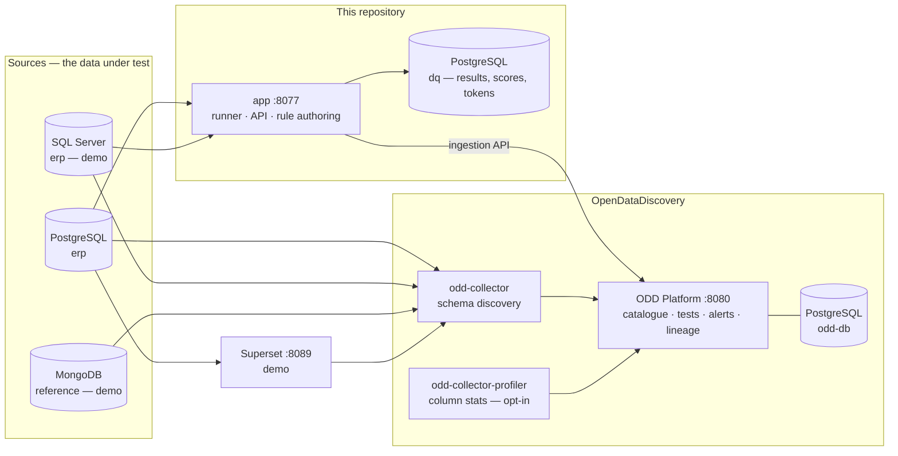

`compose.yaml` is the boxes on the left and in the middle: `db` (one server,
two databases — `erp` and `dq`), `app`, `odd-db`, `odd-platform`,
`odd-collector`, and the profiler behind `--profile profiling`.
`compose.demo.yaml` is SQL Server, MongoDB and Superset — the second shape of
the problem, kept out so that what the project *is* cannot be misread as
requiring a SQL Server and a BI tool.

| port | what |
|---|---|
| 8077 | the API, and the pointer page listing its routes |
| 8080 | ODD Platform — this is the UI you actually use |
| 5442 | the source Postgres (`erp`, `dq`) — 5442 so it will not collide with a host install |
| 5433 | ODD's own Postgres |
| 8089 | Superset, demo only |

---

## 3. The contract is the only source of truth

One file drives six things. Nothing else holds a copy.

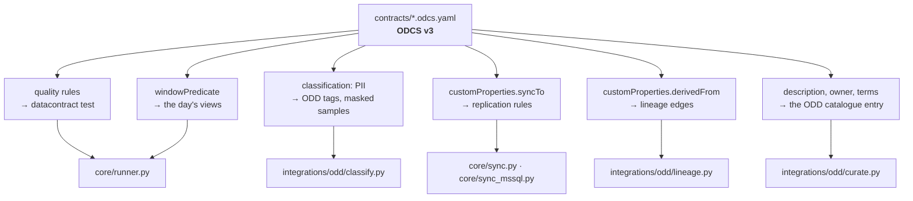

The consequence that matters: **the UI is an editor for this file.** Saving a
rule from ODD's Data Quality page appends ODCS to the contract on disk and
re-runs it. There is no second store of rules to drift out of step, which is
why `contracts/` is a bind mount rather than baked into the image.

---

## 4. The daily run

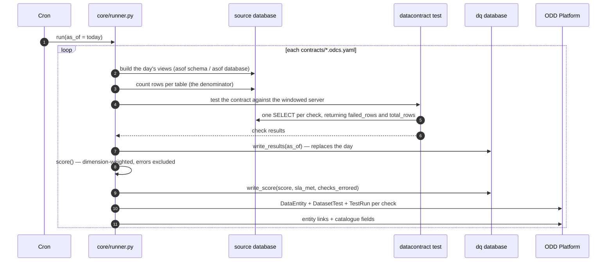

Four things in that picture are not obvious:

* **The window is rebuilt every run**, because "the day's rows" is a moving
  definition. On Postgres it is a schema of views (`asof_*`); on SQL Server it
  is a whole *database* (`erp_asof`), because T-SQL has no `search_path` and a
  rule written `dbo.sales_orders` cannot be redirected to a second schema.
* **The row count is ours.** `datacontract test` reports `row_count` for the
  checks it derives and not for the SQL a person wrote, so the runner counts
  each table once per run. Without it, every custom rule has a `fail_ratio` of
  zero and the volume half of the score silently does nothing.
* **Writing a day replaces it.** A check that errored yesterday and no longer
  exists must not stay on the board as an open failure for ever.
* **A run that could not connect is not a bad score.** See §6.

---

## 5. The window

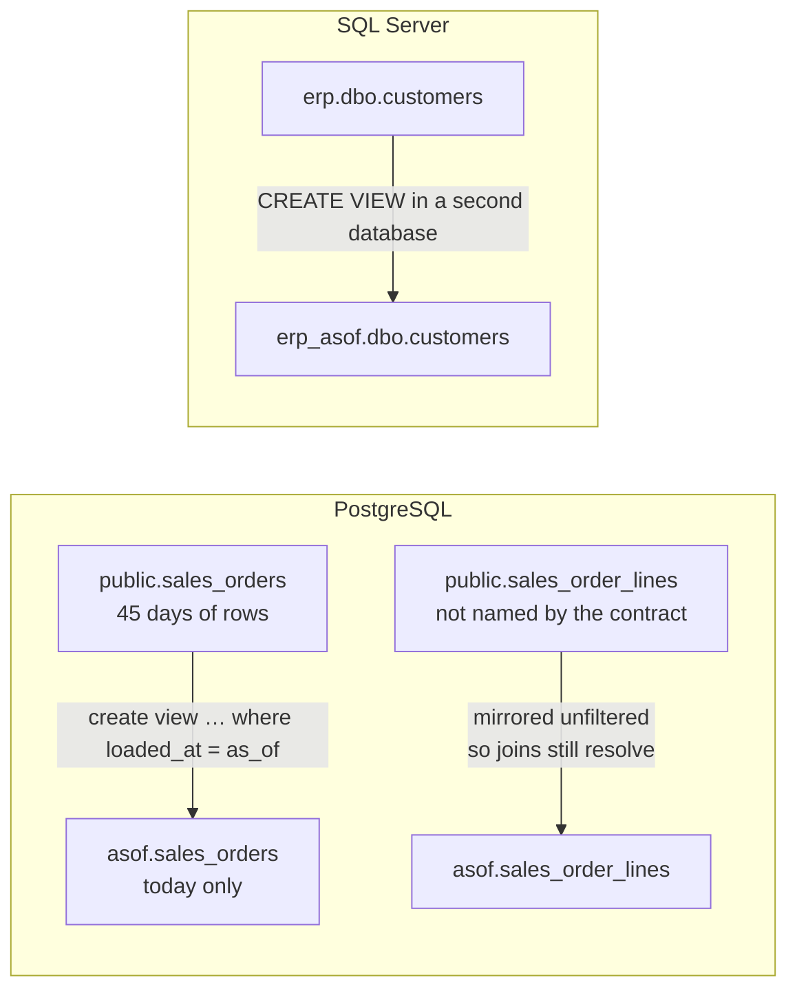

The contract states the predicate (`windowPredicate`), so a table whose arrival
column is not `loaded_at` is still windowable. Freshness is the one check
deliberately never windowed — a freshness rule inside the day's rows can only
ever pass.

The comparison this exists to win: over the same 45 days, with the same data
and the same checks, cumulative scoring turns an incident into a line that does
not move. `--window cumulative` still exists to reproduce that.

---

## 6. Scoring, and the third status

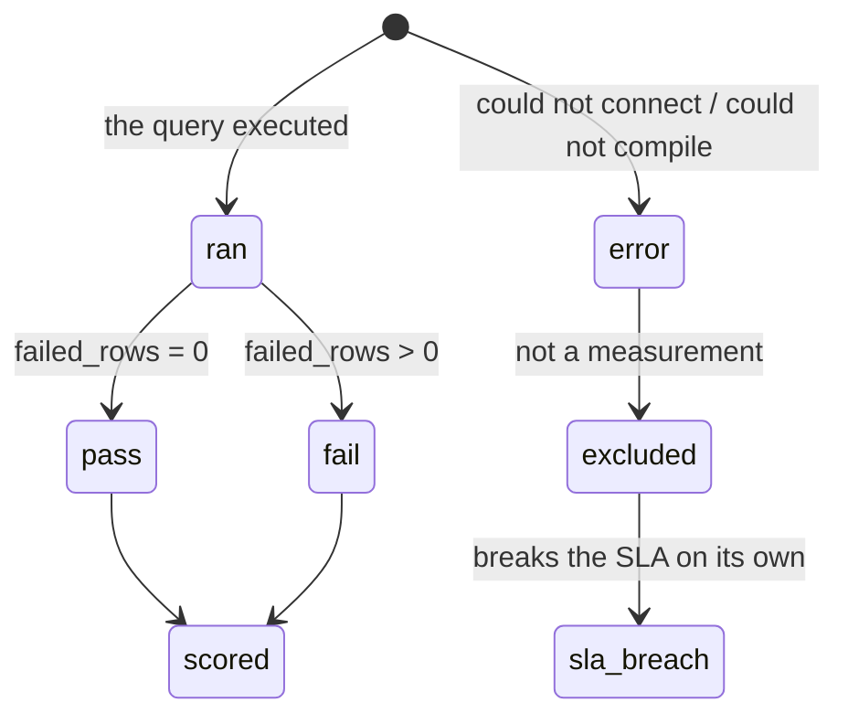

```
score = 0.6 · Σ(w · passed) / Σw   +   0.4 · Σ(w · (1 − fail_ratio)) / Σw
```

`w` is the weight of the rule's ODCS **dimension**, not a severity: the
contract stays vendor-neutral and what a failure costs is an operator decision,
so the weights live in `core/scoring.py`. Completeness, uniqueness, consistency
and timeliness weigh 5 because they break joins; accuracy, conformity, coverage
and schema weigh 3; `unknown` weighs 1 so an unclassified rule cannot dominate
a score by accident.

Both halves are needed. A pure volume score reads one bad row in a million as
0.999999 and never breaches an SLA. A pure binary score cannot tell a typo from
an outage.

`error` is excluded from the score and counted separately: an unreachable
source used to score near zero, which reads as "the data is terrible" when the
truth is "we could not look" — and those two go to different people. Nothing is
forgiven, though: `sla_met = score >= sla_min AND checks_errored = 0`.

---

## 7. Where the results live

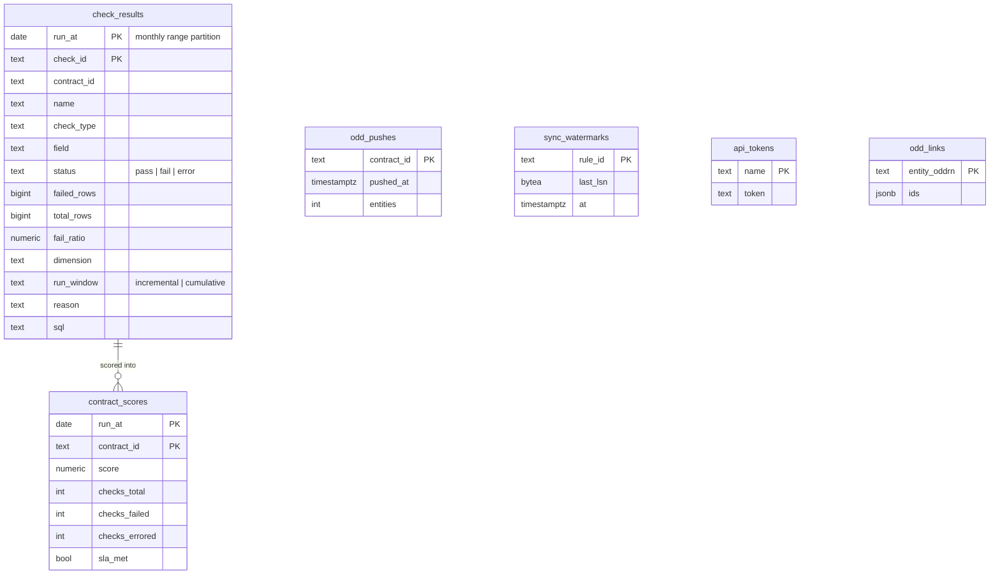

Plain PostgreSQL. Monthly range partitions plus a BRIN index on `run_at` give
the time-series access pattern without a time-series database — the invariant
is *no new infrastructure without a row count to justify it*.

`run_window` rather than `window`: `window` is a reserved word.

**Results outlive checks.** Deleting a rule from a contract leaves its history
behind, so anything reading results joins `checks` or handles orphans.

---

## 8. What appears in ODD

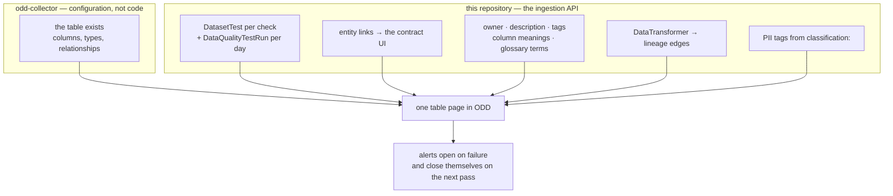

Everything is addressed by **ODDRN** — ODD's URN for a thing. A test's ODDRN is
built from the *full* check id, never its last dotted segment:
`customer_id.unique` and `tax_id.unique` both end in `unique`, and would
otherwise merge into one catalogue entity.

The contract panel on ODD's Data Quality page is a **fork of
`odd-platform-ui`** (ADR 0009): the SPA is a single jar on the platform's
classpath, so only the UI is rebuilt and the backend is untouched. The patch is
two anchors in `DataQualityContent.tsx` and it *fails the build* when they
move.

---

## 9. Blast radius — the question the whole thing is pointed at

A check fails. What breaks?

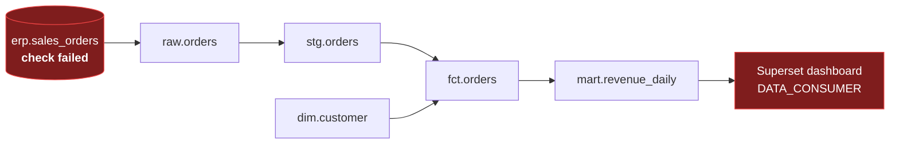

The two ends of that chain are found automatically — the collector reads the
source schema, and its Superset adapter maps a chart to the tables behind it.
The **middle cannot be**: a Prefect flow or a Python script that selects out of
one database and inserts into another leaves no trace in either engine. There
is no view definition to parse and no foreign key to follow.

So the contract declares it:

```yaml
customProperties:
  - property: derivedFrom
    value: [erp.sales_orders]        # contract ids, ODDRNs as an escape hatch
  - property: derivedBy
    value: "select ... from raw.orders where customer_id is not null"
```

`integrations/odd/lineage.py` turns each declaring contract into a
`DataTransformer`, and an unresolvable reference is **reported, not dropped** —
a graph missing an edge still looks complete, and someone then reads a blast
radius smaller than the real one.

This is dataset-level. ODD cannot represent column-level lineage at all
(`DataTransformer` is inputs/outputs/sql; an edge is `{source_id, target_id}`),
and dataset-level is what "which dashboards break" needs.

---

## 10. Keeping a second database in step

Two engines, two mechanisms, one contract syntax. Both are the *database's own*
replication rather than a connector runtime — the invariant again.

### PostgreSQL: logical replication

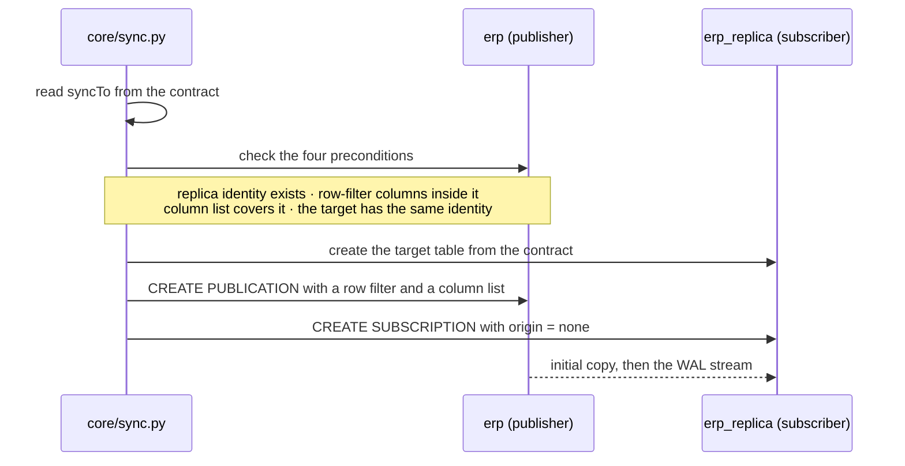

The preconditions are checked up front and are not warnings, because logical
replication fails **after** the initial copy, in a background worker that only
writes to the server log. A broken sync looks exactly like a working one; the
fourth condition — the *target* needing the same replica identity — is entirely
silent.

A publication's column list is a **privacy boundary**, not an optimisation: a
column outside it never reaches the replica, which is how a classified column
stays out.

`origin = none` (PG16) makes a bi-directional pair possible without an infinite
loop. It has no conflict resolution — last writer wins, and a genuine conflict
stops the worker — so it is a documented capability, not a default.

### SQL Server: change data capture

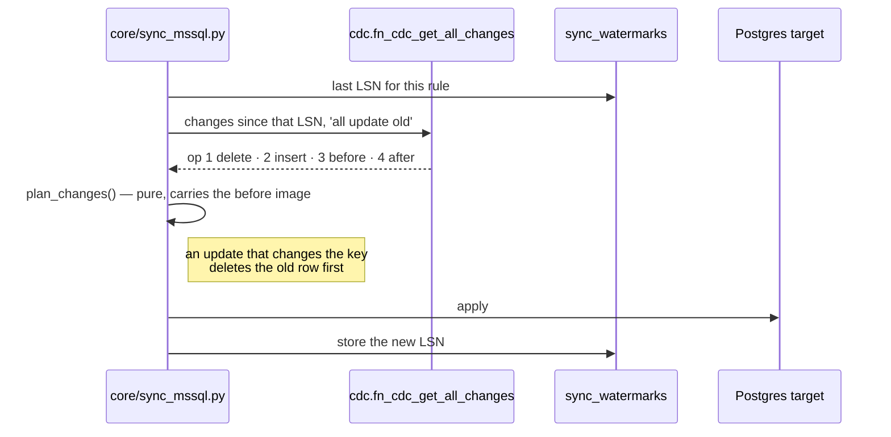

`'all'` returns operations 1, 2 and 4 — no before image — and an update that
changed a primary key then left the row under **both** names. That was
measured, not read.

CDC is a *SQL Server Agent* feature: `sp_cdc_enable_table` succeeds with the
Agent stopped and then nothing ever lands in the change table.

---

## 11. Authoring a rule without writing SQL

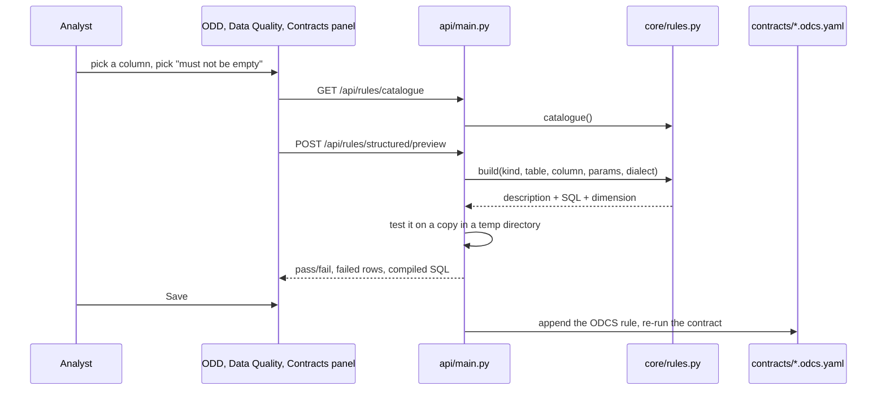

The vocabulary is fixed and lives on the server: `not_null`,
`accepted_values`, `between`, `not_negative`, `max_length`, `matches`,
`not_in_the_future`, `foreign_key`, `unique`. The UI holds none of it — it
renders whatever `/api/rules/catalogue` returns.

**Why the structured routes need no token and the raw-SQL routes do.** A form
that composes SQL from a fixed vocabulary and a declared column cannot express
anything but a count over one table; the column is validated against the
contract's declared properties, so a rule cannot even name a column that does
not exist. Raw SQL can express anything, runs against the source, and is
therefore behind a bearer token — one the backend generates and persists on
first start, because asking an operator to invent a secret before the product
works is how a quick start turns into a support thread.

Preview never touches the real file: the draft is written to a copy of the
contract in a temporary directory and tested there.

---

## 12. Module map

| module | one job |
|---|---|
| `core/runner.py` | build the window, run `datacontract test`, persist, score, push |
| `core/store.py` | the DDL, the monthly partitions, the writes |
| `core/scoring.py` | dimension-weighted score |
| `core/sample.py` | rewrite a check's own SQL into the rows it counted (masked when classified) |
| `core/rules.py` | the fixed rule vocabulary, compiled per dialect |
| `core/sync.py` | contract → Postgres publication/subscription |
| `core/sync_mssql.py` | SQL Server CDC → Postgres target |
| `core/bootstrap_db.py` | create a database a script needs, and grant the reader on it |
| `api/main.py` | read API, plus rule authoring that writes ODCS |
| `integrations/odd/mapper.py` | ODDRN vocabulary |
| `integrations/odd/from_datacontract.py` | check results → ODD tests and runs |
| `integrations/odd/curate.py` | owner, purpose, column meanings, glossary, query examples |
| `integrations/odd/classify.py` | PII detection and tagging |
| `integrations/odd/lineage.py` | `derivedFrom` → `DataTransformer` |
| `integrations/odd/entity_page.py` | the links on the table's own page |
| `demo/medallion.py` | the warehouse a scheduler would build, so the lineage has a middle |

Modules stay under ~150 lines. Past that it is usually two concerns.

---

## 13. What is deliberately not here

* **No Elasticsearch.** ODD's search is Postgres full-text. This is the single
  hardest constraint in the project — see ADR 0012.
* **No orchestrator.** The daily unit is one command; cron is enough, and
  Prefect or Airflow can call the same command.
* **No second store of rules.** ADR 0001.
* **No hand-derived checks.** `datacontract test` derives them for every engine
  it supports; an engine we maintained ourselves was deleted in `2447e69`.
* **dbt and Great Expectations are output formats, not dependencies.**
