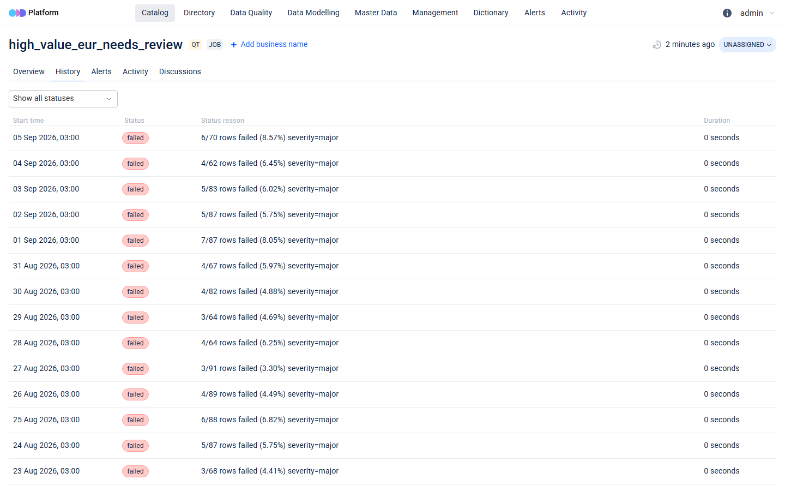
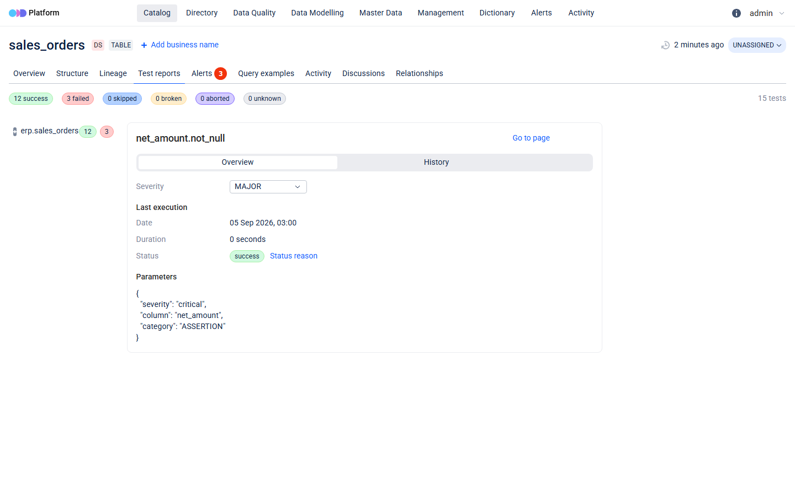
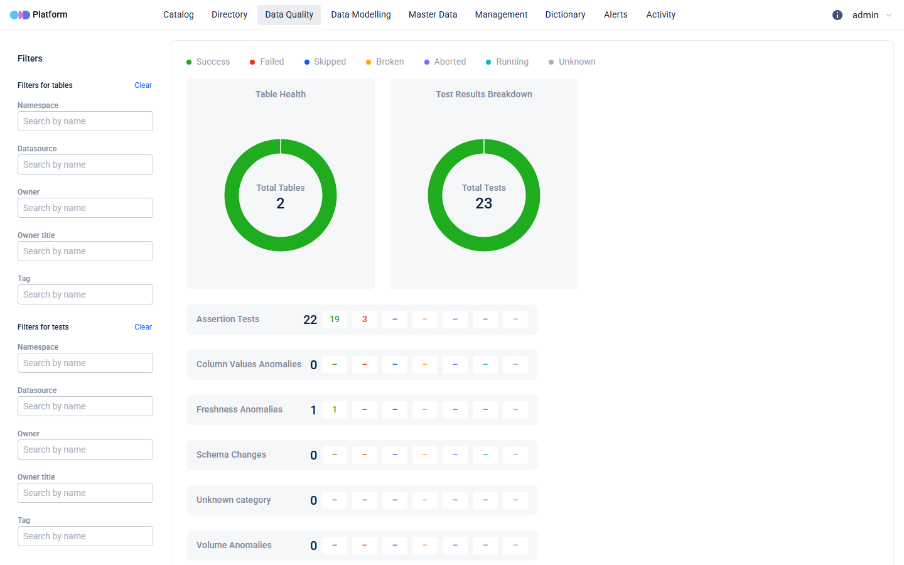

# ODD Platform vs the contract layer — verified against a running instance

The first version of this document was written from the ODD specification and
`odd-dbt`'s source, without ever starting the platform. This version is the
same claims re-checked against a real instance. Every verdict below is
`confirmed`, `partly confirmed` or `refuted`, and says what was actually seen.

**Trial setup.** `ghcr.io/opendatadiscovery/odd-platform:latest` from
`deploy/odd-compose.yaml`, `AUTH_TYPE=DISABLED`, empty database. Pushed: 2
contracts, 23 derived checks, 45 days of runs (2026-07-23 .. 2026-09-05) —
46 payloads, 1060 entities. ERP on `localhost:5442`, `DQ_HOST=dq.local`.

---

## 0. What the old document did not know: ingestion does not work out of the box

Not a claim in the original — an omission, and the first thing that happened.

`POST /ingestion/entities` returned **404** before looking at a single entity:

```
{"code":"USR002","message":"DataSource with oddrn //datafletch/host/dq.local is not found"}
```

ODD only accepts a `DataEntityList` whose `data_source_oddrn` it already knows.
Collectors register themselves at startup; we are not a collector, so nothing
had. The runbook's "10-minute path from zero" quietly assumed a step that does
not exist.

Two further details, both costing time:

* `POST /ingestion/datasources` — the endpoint the name suggests — returns
  **500** with `AccessDeniedException: Token is missed`. The compose file sets
  `AUTH_INGESTION_FILTER_ENABLED: "false"`; that setting does not disable the
  ingestion filter on this path in this build.
* `POST /api/datasources` (the platform API, not the ingestion API) works with
  auth disabled, is idempotent-by-name (a repeat is a resolvable 400
  `USR003 Data source with this name already exists`), and returns a collector
  token we do not need.

`push.py` now registers the data source itself if it is missing, so the trial is
one command against an empty platform. Registration is the honest fix: the
payloads were never malformed — `odd-models` had validated all 1060 entities
before the first POST, and every payload was accepted unchanged once the data
source existed.

---

## 1. "No row counters. The volume signal can only be shipped as free text in `status_reason`."

**Verdict: confirmed, with one correction in ODD's favour.**

`DataQualityTestRun` really is `{data_quality_test_oddrn, start_time, end_time,
status, status_reason}` — there is no numeric field, and `failed_rows` /
`total_rows` / `fail_ratio` have nowhere to go but the string.

The correction: the original text implied this makes the volume signal
effectively invisible. It does not. `status_reason` is a first-class column in a
check's **History** tab, so the daily row counts read as a legible series:



45 daily runs, each showing `6/70 rows failed (8.57%) severity=major`. The data
is there and a human can read it. What ODD cannot do with it is anything else:
no sort by fail ratio, no threshold, no chart, no aggregate, no "which check
degraded most this week" — to ODD each of those is an opaque string. The
distinction that mattered to us (a typo vs an outage) survives only in the
reader's head.

Two smaller findings in the same area:

* The dataset overview shows **Rows 0** for both tables. We never send a row
  count, and nothing derives one from the runs.
* The inline test-report panel pages the history 10 runs at a time
  (`/api/dataentities/{id}/runs?page=1&size=10`). All 45 are stored and the
  full list is on the check's own page; the panel just does not show them.

## 2. "No severity on the run or the test. Severity is an operator setting inside the platform, not part of the ingested payload."

**Verdict: confirmed, and now precise about where it bites.**

ODD *does* store and display what we send: the expectation body appears verbatim
under **Parameters** on each test, including `"severity": "critical"`. So the
contract's severity is visible.

It is also ignored. ODD keeps its own **Severity** control — a dropdown on each
test — and it defaults to `MAJOR` regardless of the payload:



`net_amount.not_null` is `critical` in `contracts/sales_orders.contract.yaml`,
reads `"severity": "critical"` in ODD's own Parameters box, and sits at `MAJOR`
in the control that ODD actually uses. The two never meet.

One correction to the runbook, which guessed this was set per dataset: it is
**per test**. With 23 checks that is 23 dropdowns to align by hand, and nothing
keeps them aligned when the contract changes. Alerts do not carry severity at
all (see §6).

## 3. "No score, no SLA evaluation. Pushed as dataset metadata, i.e. decoration."

**Verdict: partly refuted — wrong in both directions.**

**Wrong the first way: ODD does score.** The dataset overview carries a
`Test report — 80% score, 15 tests` panel and an `SLA 12/15` widget. The
original document said ODD "counts passing and failing tests"; it also divides
them and calls the result a score, and it has a widget literally labelled SLA.

That score is not ours and does not replace ours. It is an unweighted pass
ratio over the **latest** run only: a failing `critical` not_null and a failing
`minor` cosmetic rule each cost 1/15, and one failed row weighs the same as
four thousand. Our score is severity-weighted and blends pass/fail with fail
ratio precisely because that flattening is what made a dashboard decorative.
Both numbers can be on screen at once and mean different things, which is worse
than only having one.

**Wrong the second way: `contract_sla_min_score` is not decoration, it is
discarded.** ODD's stored metadata for `sales_orders` is exactly one field:

```
contract_id (STRING) = "erp.sales_orders"
```

`contract_sla_min_score = 0.95` was sent and is simply not there. A direct
probe — one entity carrying a string, an int, a bool, a float and a list —
came back with the string, the int and the bool stored and **the float and the
list dropped without an error**. So:

* every numeric threshold in a contract (`min`, `max`, `min_score`) is lost on
  the metadata path;
* `allowed: [...]` is lost on the metadata path too — `currency.accepted_values`
  has no `values` in its stored metadata.

Both survive on the *expectation* path, because `check_entity` stringifies
params: the test's Parameters box does show
`"values": "['TRY', 'USD', 'EUR']"`. That is luck, not design. Anything we want
ODD to keep must be a string, an int or a bool.

## 4. "No scoring window. Our incremental-vs-cumulative distinction is not expressible."

**Verdict: confirmed, and understated.**

The platform-wide **Data Quality** dashboard has no time axis of any kind. Two
donuts and a category table, all reflecting the latest run:



45 days of history are in the database and none of it is on this page. There is
no trend line, no per-day view, no way to ask "which days were bad" — so the
question the runbook posed ("does the platform-wide view distinguish the
incident days?") has a flat answer: **no**, and not because the window is wrong
but because there is no window.

One thing on this page was **our** bug, not ODD's. Before the fix the dashboard
read `Total Tests 0` with all 23 checks ingested and visible on their datasets.
ODD buckets quality tests by `DataQualityTestExpectation.category`, and we were
sending none, so every test fell outside every bucket and was counted nowhere.
Setting the category (`FRESHNESS_ANOMALY` for freshness, `ASSERTION` for the
rest — ODD's other categories describe anomaly detection, which a deterministic
contract check is not) produces the screenshot above: 23 tests, 22 assertions
(19 pass / 3 fail), 1 freshness. The old document's claim was right about the
window and would have been right about the dashboard for the wrong reason.

## 5. "No contract. There is no contract entity and no link from 'this test exists' to 'because the contract says so'."

**Verdict: confirmed.**

`contract_id` survives as string metadata and `contract:erp.sales_orders` as a
tag; both are searchable and both appear as facets on the landing page. Neither
is an object. There is no contract page, no version, no diff, nothing that
breaks when a rule is removed. The suite name (`erp.sales_orders`) is the only
grouping ODD understands, and it is a label.

## 6. Alerts — the part the original document assumed rather than checked

**Verdict: works, and is the strongest thing ODD gave us.**

After the 45-day backfill: **3 open, 10 `RESOLVED_AUTOMATICALLY`, 0 manual.**
An alert opens on a check's first failure, does not duplicate on subsequent
failures (it appends to its own history —
`Test customer_id.not_null@2026-09-02 failed with status FAILED`), and closes
by itself when the next run of that check passes. Confirmed by pushing a single
passing run for a failing check and watching the open count drop 3 → 2 without
touching anything.

This is real lifecycle behaviour that we have not built and would not want to.
Two caveats:

* Every alert is titled `Failed DQ test`. The failing check's name is one click
  away under "Show history"; three simultaneous alerts on one table are
  indistinguishable in the list.
* Alerts carry no severity, so a `critical` not_null and a `minor` cosmetic rule
  produce identical rows.

## 7. Catalog fidelity — the mapping table, re-checked

| our concept | ODD concept | claimed | actual |
|---|---|---|---|
| dataset from contract schema | `DataEntity(TABLE, DataSet(field_list))` | full | **partly** — name, type, logical type, primary key and column description all land and render; `is_nullable` is sent as `false` and comes back `null` from `/api/datasets/{id}/structure`, with no UI affordance |
| derived check | `DataEntity(JOB, DataQualityTest)` | full | **confirmed**, once `expectation.category` is set (§4) |
| daily run | `DataEntity(JOB_RUN, DataQualityTestRun)` | partial | **confirmed partial** (§1) |
| contract ownership / domain | `owner`, `tags` | full | **confirmed** — tags render as landing-page facets (`domain:sales`, `severity:critical 15`) |
| test ↔ dataset link | ODDRN in `dataset_list` | full | **confirmed** — the test page links to `sales_orders` and the dataset counts the test |
| contract metadata | `MetadataExtension` | full | **refuted** — strings, ints and bools only (§3) |

The dataset ODDRNs are still plain PostgreSQL ODDRNs, so the merge-with-collector
argument stands — though it was not exercised here: no collector was run, and
the tables appear under the `datafletch-contracts` data source we registered.
That claim remains untested.

## Practical notes from the first version — all held

* Run ODDRNs unique per execution (we use the run date). No collisions in 1035
  run entities.
* Check ODDRNs built from the full check id, not the last segment.
  `customer_id.unique` and `tax_id.unique` are two distinct entities in the
  catalog, as intended.
* Results outlive checks; `push.py` joins against live checks and reports
  retired ones instead of pushing orphan runs.

---

## Does the split still hold?

The original split:

* **ODD owns:** catalog objects, lineage, glossary, ownership, tags, alert
  lifecycle, per-run history, search.
* **The contract layer owns:** contracts as source of truth, check derivation,
  artifact emission, scoring window, severity-weighted score, SLA, trend.

**It holds, with two lines redrawn.**

**Severity moves fully to us.** The original had severity as a shared concern —
we declare it, ODD stores it as a tag. In practice ODD has its own severity
field that ignores ours and defaults to `MAJOR` on every test, and its alerts
ignore severity entirely. Two severities that never agree is worse than one, so
ODD's is a field to leave alone, and severity-based routing cannot be built on
ODD's alerts as they stand.

**Score is now contested, not vacant.** The original assumed ODD had no score
and ours would sit in the empty space. ODD has a score, on the dataset page, in
the place a user looks first. Ours is not visible there and cannot be — no
numeric run fact, no float metadata. So the split is not "we own scoring
because ODD has none"; it is "ODD shows an unweighted latest-run pass ratio and
we show a severity-weighted trend, and a user who sees both without being told
the difference will trust the wrong one." Either our UI has to own the score
narrative explicitly, or ODD's panel needs to be read as what it is.

Everything else survived contact. Alert lifecycle is better than assumed and is
worth not building. Catalog, structure, tags, search and the ODDRN join key all
worked on the first push. And the ingestion layer is a straight fit: 1060
entities, validated locally, accepted unchanged — the only thing missing was a
data source nobody had told us to create.
