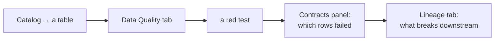
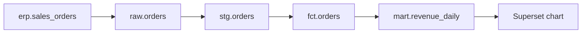

# Tutorial

Eight lessons, in order. Each one ends with something you can see. If a command
fails, §9 lists the failures that are worth recognising on sight.

`docs/architecture.md` explains what these commands are doing underneath; you
do not need it to follow this, and it will make more sense afterwards.

Everything runs through compose, so every command below is prefixed
`docker compose exec app`. If you installed the package locally
(`pip install -e ".[dev]"`), drop that prefix and set `ERP_DSN` / `DQ_DSN`
yourself.

---

## Lesson 0 — Bring it up

```bash
docker compose up -d db odd-db odd-platform
```

Wait for ODD: `docker compose logs -f odd-platform` until it stops moving, or
just open http://localhost:8080. It takes a minute or two on a first start
because it migrates its own database.

Then mint the collector's token and start the rest:

```bash
./deploy/odd-bootstrap.sh
```

```bash
docker compose up -d
```

Now put some data under it, and build 45 days of history:

```bash
docker compose exec app python seed/seed.py
```

```bash
docker compose exec app python core/runner.py --backfill-days 44 --odd-url http://odd-platform:8080
```

**What you should see.** http://localhost:8080 → *Catalog* lists your tables.
Open `customers` and its **Data Quality** tab has tests on it, with a run
history going back 45 days.

> The contract UI on :8077 is a pointer page listing the API routes. The UI you
> actually use is ODD's — the contract panel lives inside its Data Quality tab.
> That is deliberate: ODD already has search, ownership, lineage and alerting,
> and a second dashboard would have to be kept in step with it.

---

## Lesson 1 — Read a failure down to the rows

This is the loop the whole project exists for.



1. Open ODD → **Catalog** → `sales_orders` → **Data Quality**.
2. The tests are listed with their last result. A failing one is red.
3. Scroll to the **Contracts** panel below them. It shows the contract behind
   the table, the score trend as a sparkline, and — for each failing check —
   **the rows it actually counted**, not just how many.
4. A column the contract marks `classification: pii` comes back masked. The
   sampler rewrites the check's own SQL from `count(*)` into the rows, so what
   you see is by construction the same set the number came from.

Same thing from the API, if you would rather:

```bash
curl -s localhost:8077/api/overview | head -40
```

```bash
curl -s "localhost:8077/api/checks/erp.customers.country.conformity/sample?as_of=2026-09-06"
```

**Why some checks show as `error` and not `fail`.** A check that could not run
is not a check that failed. It is excluded from the score and counted
separately, and it breaks the SLA on its own — an unreachable database is an
engineering problem, not a data problem, and the two go to different people.

---

## Lesson 2 — Add a rule without writing SQL

In ODD → any table → **Data Quality** → **Contracts** panel → **Add rule**.

1. Pick a column from the dropdown. It only lists columns the contract
   declares.
2. Pick a rule: *must not be empty*, *must be one of*, *must be between*,
   *must not be negative*, *at most N characters*, *must look like*, *must not
   be in the future*, *must exist in another table*, *must have no duplicates*.
3. Fill in the parameters the rule needs.
4. **Preview.** The rule is compiled to SQL, written to a *copy* of the
   contract in a temporary directory, and run there. You get back pass/fail,
   how many rows failed, and the SQL that was generated.
5. **Save.** The rule is appended to `contracts/<id>.odcs.yaml` on disk and the
   contract is re-run immediately.

Open the file afterwards — the point is that there is no hidden store:

```bash
docker compose exec app tail -20 contracts/erp_customers.odcs.yaml
```

```yaml
- type: sql
  description: segment must be one of SMB, MID, ENT
  query: select count(*) from customers where segment is not null and segment not in ('SMB','MID','ENT')
  mustBe: 0
  dimension: conformity
```

That is ODCS. `datacontract test` reads exactly this file; nothing translated
it on the way in.

**No token needed for this.** A form that composes SQL from a fixed vocabulary
and a column the contract declares cannot express anything but a count over one
table. See Lesson 3 for the part that can.

---

## Lesson 3 — Add a rule that needs real SQL

Some rules do not fit a form — a cross-table agreement, a window function, a
business rule with three conditions. Those go through the raw-SQL route, which
is behind a bearer token because it runs whatever you write against the source.

You do not create the token. The backend generates one on first start and
persists it; read it from the log:

```bash
docker compose logs app | grep "rule authoring token"
```

Then, in the same panel, switch to **Raw SQL**, paste the token once, and write
a query that returns **one number**:

```sql
select count(*)
from sales_orders o
left join customers c on c.customer_id = o.customer_id
where c.customer_id is null
```

Two rules about that SQL, both of which have cost time:

* **Do not pin the window yourself.** No hardcoded `loaded_at` predicate — the
  runner puts the day's rows in front of you already, and a rule that filters
  by date again silently ignores the window switch.
* **On Postgres, do not qualify the schema** (`public.customers` bypasses the
  day's views). On SQL Server you *must* write `dbo.`, which is why the window
  there is a separate database rather than a schema.

---

## Lesson 4 — Put a new table under contract

No code changes. Drop a file in `contracts/`:

```yaml
apiVersion: v3.0.2
kind: DataContract
id: erp.invoices
name: Invoices
version: 1.0.0
status: active
description:
  purpose: What we billed, and when.

servers:
  - server: erp                                  # where the table really is
    type: postgres
    host: db
    port: 5432
    database: erp
    schema: public
  - server: erp_daily                            # the same tables, one day only
    type: postgres
    host: db
    port: 5432
    database: erp
    schema: asof

slaProperties:
  - property: frequency
    value: 1
    unit: d

schema:
  - name: invoices
    physicalName: invoices
    logicalType: object
    physicalType: table
    properties:
      - name: invoice_id
        logicalType: integer
        physicalType: bigint
        description: "The invoice. Primary key."
        required: true
        unique: true
        primaryKey: true
      - name: amount
        logicalType: number
        physicalType: numeric
        description: "Net amount in the invoice currency."
        required: true
    quality:
      - type: sql
        description: amount must not be negative
        query: select count(*) from invoices where amount < 0
        mustBe: 0
        dimension: accuracy
```

```bash
docker compose exec app python core/runner.py --contract erp.invoices --odd-url http://odd-platform:8080
```

Three things the tests will fail you on if you skip them, because each one has
gone wrong before:

* **The `erp_daily` server block.** Without it the contract is never windowed,
  and it is scored cumulatively — which flattens every incident into a line
  that does not move.
* **A description on every column.** The catalogue entry in ODD is filled from
  the contract, never by hand, so an undescribed column is a blank field in the
  UI that nobody will ever go back and fill.
* **A `dimension` on every rule.** It is what the score weights by. Leaving it
  off makes the rule `unknown`, weight 1.

---

## Lesson 5 — The blast radius

The demo answers "a check failed, which dashboard is wrong?" end to end. It
needs the demo sources:

```bash
docker compose -f compose.yaml -f compose.demo.yaml --profile demo up -d
```

```bash
./deploy/odd-bootstrap.sh --demo
```

Seed the SQL Server ERP (the inner quotes matter — the password lives in the
container's environment, so it has to be expanded there):

```bash
docker compose exec -T mssql sh -c '/opt/mssql-tools18/bin/sqlcmd -S localhost -U sa -P "$MSSQL_SA_PASSWORD" -C -i /demo/mssql-seed.sql'
```

Build the warehouse a scheduler would build, then the dashboards on top of it:

```bash
docker compose exec app python demo/medallion.py
```

```bash
docker compose exec app python demo/superset-assets.py
```

```bash
docker compose exec app python integrations/odd/lineage.py --url http://odd-platform:8080
```

Now open a source table in ODD → **Lineage**, and walk downstream:



`demo/medallion.py` moves rows in Python on purpose, because that is the honest
shape of the problem: Postgres cannot query another database, half the ERP is
SQL Server, and a Prefect flow leaves no trace in either engine. Nothing can
infer that middle — the warehouse contracts declare it with `derivedFrom`.

The canvas does not fit a long chain in one screen. The walk is easier to read
from the API:

```bash
curl -s "localhost:8080/api/dataentities/<id>/lineage/downstream?lineage_depth=10"
```

---

## Lesson 6 — Keep a second database in step

The rule is in the contract, next to the columns it copies:

```yaml
customProperties:
  - property: syncTo
    value:
      server: replica
      filter: "country = 'TR'"
      identity: [customer_id, country]     # wider than the PK, on purpose
      columns: [customer_id, name, country, segment]   # tax_id is not here
```

**Postgres — logical replication.** Always check before applying:

```bash
docker compose exec app python core/sync.py --check
```

It prints every statement it would run and every reason it will not. Then:

```bash
docker compose exec app python core/sync.py --apply
```

```bash
docker compose exec app python core/sync.py --status
```

`--status` is not optional housekeeping. Logical replication fails *after* the
initial copy, in a background worker that only writes to the server log — a
broken sync looks exactly like a working one from the outside.

Note what `columns` does: **a column left out never leaves the source.** That
is the privacy boundary, not an optimisation, and it is why `tax_id` is absent
above.

**SQL Server — CDC.** Turn it on (this also creates the least-privilege login
the collector uses, which is what keeps CDC's nine bookkeeping tables out of
the catalogue):

```bash
docker compose exec -T mssql sh -c '/opt/mssql-tools18/bin/sqlcmd -S localhost -U sa -P "$MSSQL_SA_PASSWORD" -C -d erp -i /deploy/mssql-cdc.sql'
```

```bash
docker compose exec app python core/sync_mssql.py --once
```

```bash
docker compose exec -d app python core/sync_mssql.py --interval 30
```

Bi-directional is possible on PostgreSQL 16 — subscriptions are created with
`origin = none`, so changes do not loop back. It has **no conflict
resolution**: last writer wins and a real conflict stops the worker. Run it
that way only where the two sides write disjoint rows.

---

## Lesson 7 — Sensitive columns

Two halves, and you want both.

**Detection** looks at the data and reports what it found:

```bash
docker compose exec app python integrations/odd/classify.py
```

```bash
docker compose exec app python integrations/odd/classify.py --url http://odd-platform:8080
```

Without `--url` it only reports; with it, the columns are tagged in ODD. It
recognises Turkish TCKN and VKN by checksum, not by regex, so a column of
random 11-digit numbers is not reported as a national id.

**Declaration** is what actually changes behaviour. Put the finding into the
contract:

```yaml
- name: tax_id
  classification: pii
```

From then on the column is masked in sample rows, and `core/sync.py` will
refuse to put it in a publication's column list. Detection tells you where to
look; the contract is what the code obeys.

---

## Lesson 8 — Run it daily

One line in cron:

```bash
docker compose exec -T app python core/runner.py --odd-url http://odd-platform:8080
```

That rebuilds the day's views, tests every contract against its own engine,
stores the results under today's date, scores them, and pushes the runs to ODD.
Alerts open on a failure and close themselves on the next passing run — you do
not manage them.

Three variations worth knowing:

```bash
docker compose exec app python core/runner.py --as-of 2026-08-14        # re-run one day
```

```bash
docker compose exec app python core/runner.py --contract erp.customers  # one contract
```

```bash
docker compose exec app python core/runner.py --window cumulative       # the comparison
```

The last one exists to be looked at once: it scores the whole history instead
of the day, and an incident that is obvious in the daily series becomes a line
that does not move. That measurement is why the window is the default.

Column profiling is opt-in, because the image is 4.4 GB and idles at ~450 MB:

```bash
docker compose --profile profiling up -d
```

It produces column statistics — lengths, means, inferred types. It does *not*
detect PII and it does not produce lineage; those are Lesson 7 and Lesson 5.

---

## 9. When something goes wrong

| what you see | what it is |
|---|---|
| odd-collector exits with a bare 500 at startup | it has no token. `./deploy/odd-bootstrap.sh` |
| `odd-bootstrap.sh` says a collector exists but has no token | ODD reports an existing token **masked**, so it cannot be read back. The script reuses the config it wrote last time; if that is gone, delete the collector in ODD and re-run |
| every check on a contract is `error` | the source is unreachable, or `dq_reader` has no grant in that database. These do not score — they break the SLA |
| a custom rule always has `fail_ratio` 0 | it is counting rows in a table the runner did not count. Check the rule names a table the contract declares |
| a rule passes but should not | it probably pinned its own `loaded_at` predicate, or qualified `public.`, and is reading the whole table instead of the day |
| sync applied cleanly, nothing arrives | the background worker died after the initial copy. `core/sync.py --status`, then the *server* log |
| CDC enabled, change table always empty | SQL Server Agent is not running. `sp_cdc_enable_table` succeeds without it |
| an update in CDC left the row under two keys | it changed a key column and the reader was not given the before image. This is fixed; if you see it again, check the reader asks for `'all update old'` |
| ODD's catalogue is full of `cdc.*` tables | the collector is connecting as `sa`. Its mssql adapter has no schema filter — the permission grant *is* the filter |
| the contract panel is missing from the Data Quality page | you are running the upstream ODD image, not `deploy/Dockerfile.odd-platform` |
| the ODD UI build fails on a missing anchor | ODD moved the code the panel patches into. That is the build telling you a version bump needs a look — see ADR 0009 |

---

## Where to go next

* `docs/architecture.md` — what all of this is doing underneath, with diagrams.
* `docs/adr/` — why each decision exists, and what would let it be deleted.
  Read these before bumping any dependency.
* `docs/odd-gap-analysis.md` — what ODD does and does not do, verified against
  a running instance rather than its documentation.
* `CLAUDE.md` — the operating manual: invariants, and the gotchas already paid
  for.
